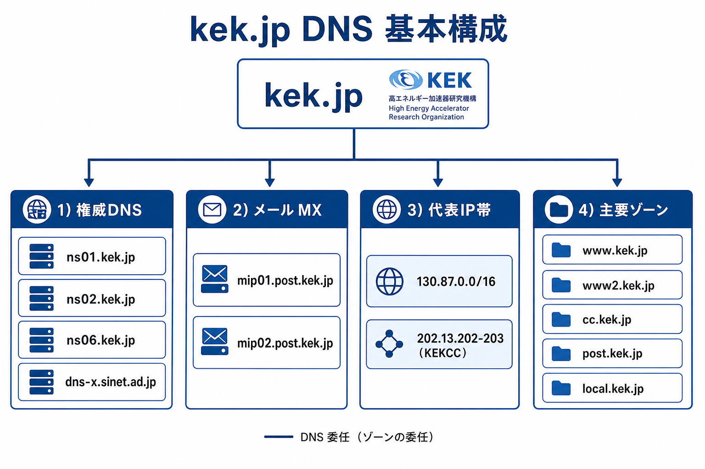
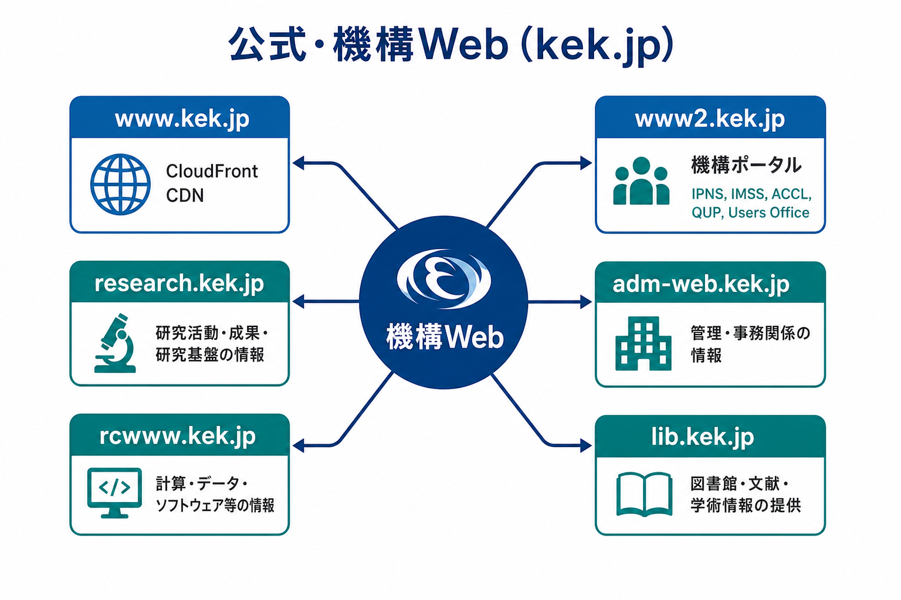
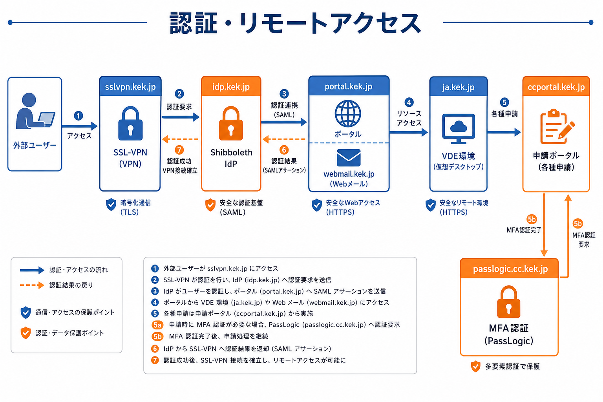
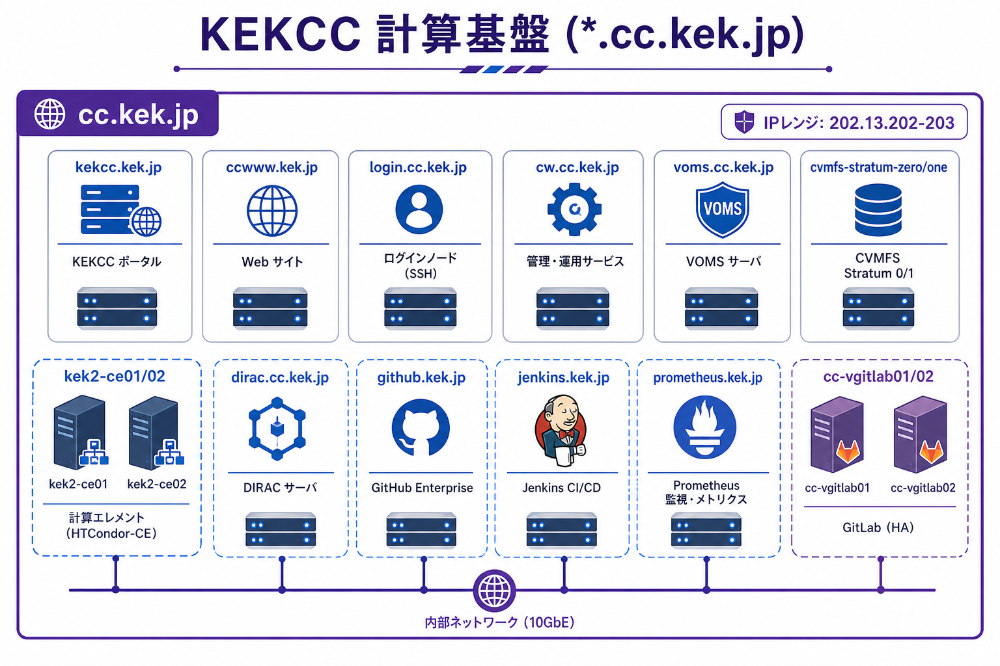
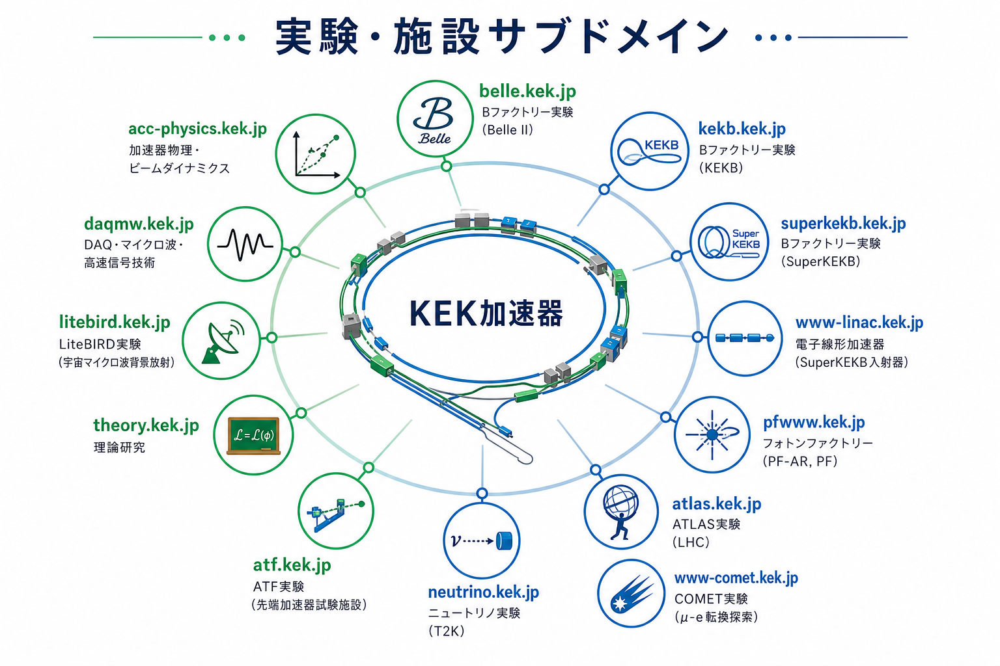
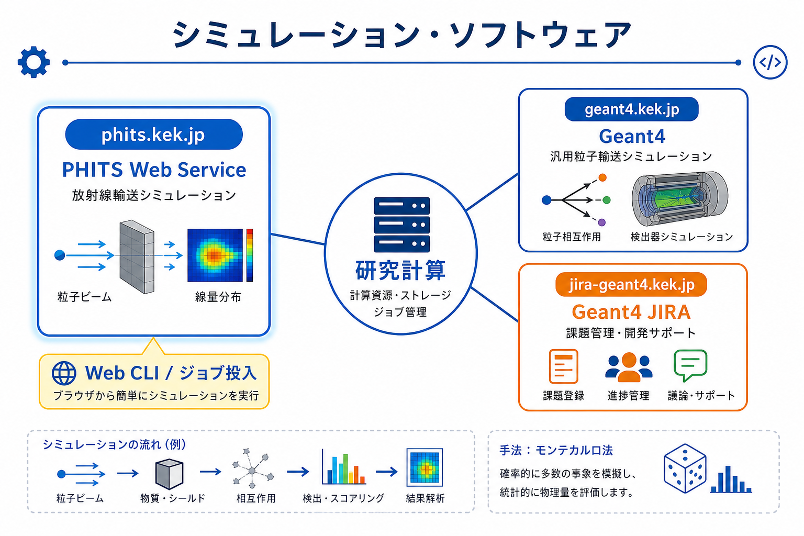
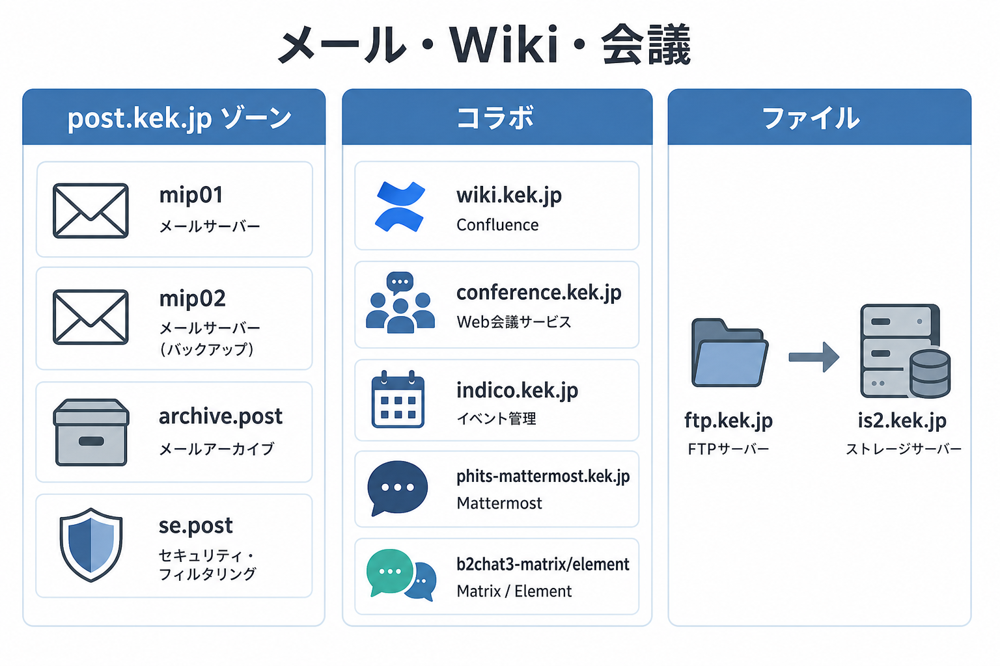
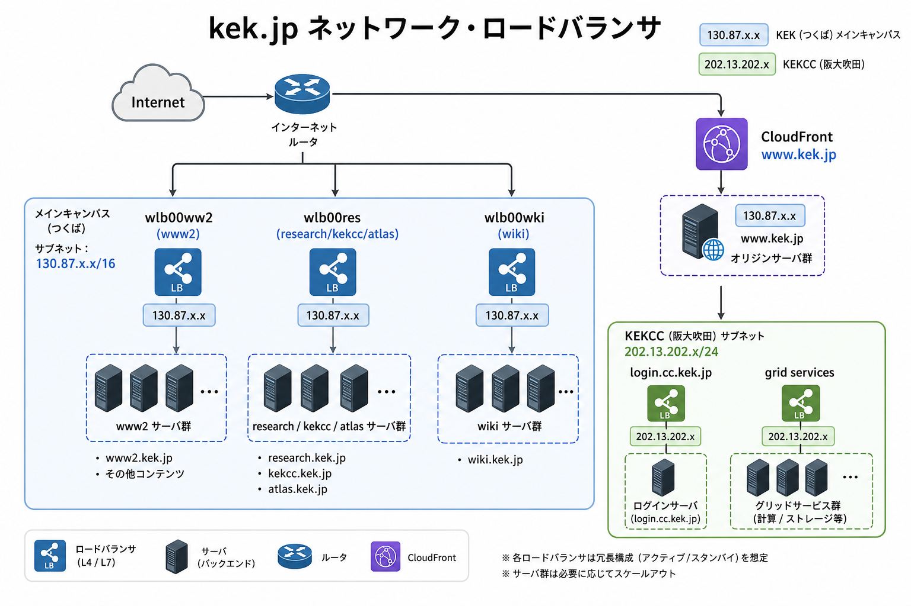
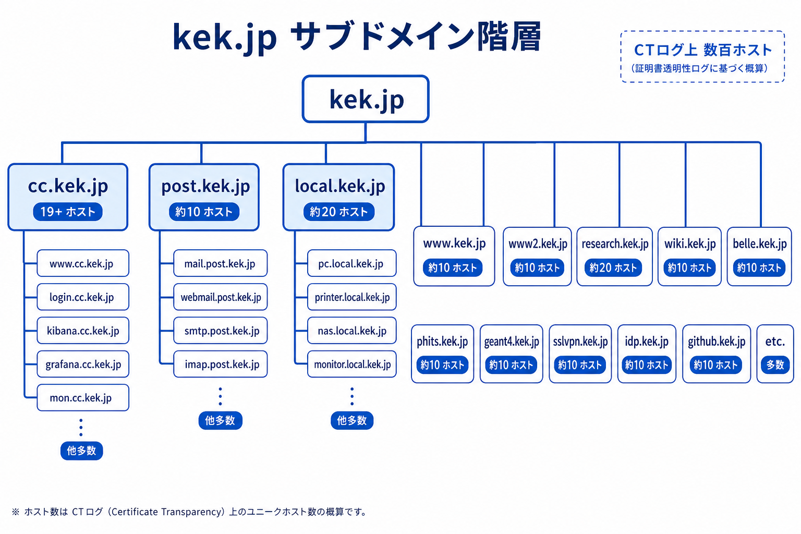
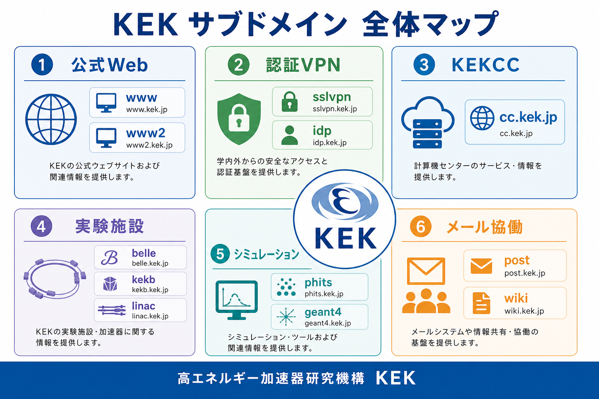

# kek.jp サブドメイン構成（公開DNS調査）

調査日: 2026-08-22  
調査方法: 公開DNS（`dig`）、Certificate Transparency（certspotter / hackertarget）、KEK公式サイト参照  
図: `figures/kek_jp/` 配下 10 枚

> **注意:** 本資料はインターネットから解決可能な公開ホスト名を対象とする。内部専用・端末名（`*-mac.kek.jp` 等）は省略。CTログ上は数百ホスト存在するが、ここでは主要サービスを概念図化した。

---

## 図1. DNS基本構成

| 項目 | 内容 |
|------|------|
| 権威DNS | `ns01` / `ns02` / `ns06.kek.jp` + SINET二次 `dns-x.sinet.ad.jp` |
| メール (MX) | `mip01.post.kek.jp` / `mip02.post.kek.jp` |
| 代表IP帯 | 主に `130.87.0.0/16`（KEKCC系は `202.13.202–203` など） |

---

## 図2. 公式・機構Web

| ホスト | 役割 |
|--------|------|
| `www.kek.jp` | 公式サイト（CloudFront） |
| `www2.kek.jp` | 機構ポータル（研究所・共同利用・アウトリーチ） |
| `research.kek.jp` | 研究系Webハブ |
| `rcwww.kek.jp` | 研究関連Web |
| `adm-web.kek.jp` | 事務・管理系 |
| `lib.kek.jp` | 図書室 |

---

## 図3. 認証・リモートアクセス

| ホスト | 役割 |
|--------|------|
| `sslvpn.kek.jp` | SSL VPN |
| `idp.kek.jp` | 学認系IdP（Shibboleth） |
| `webmail.kek.jp` / `portal.kek.jp` | Webメール・ポータル |
| `ja.kek.jp` | 仮想デスクトップ（→ `kekvde`） |
| `ccportal.kek.jp` | 計算センター申請ポータル |
| `passlogic.cc.kek.jp` | VPN MFA（PassLogic） |

---

## 図4. KEKCC 計算基盤

`*.cc.kek.jp` ゾーン。`login.cc`、`voms.cc`、`cvmfs-stratum-*`、`kek2-ce0*`、`dirac.cc`、`github.kek.jp`、`jenkins.kek.jp`、`cc-vgitlab01/02` など。

---

## 図5. 実験・施設

`belle`、`kekb`、`superkekb`、`www-linac`、`pfwww`、`atlas`、`neutrino`、`www-comet`、`atf`、`theory`、`litebird`、`acc-physics`、`daqmw` など。

---

## 図6. シミュレーション・ソフトウェア

| ホスト | 内容 |
|--------|------|
| `phits.kek.jp` | PHITS Web Service（Web CLI / ジョブ投入） |
| `geant4.kek.jp` | Geant4 |
| `jira-geant4.kek.jp` | Geant4 JIRA |

---

## 図7. メール・Wiki・会議

- **post.kek.jp ゾーン:** `mip01/02`, `archive.post`, `se.post`
- **協働:** `wiki.kek.jp`, `conference.kek.jp`, `indico.kek.jp`, Mattermost/Matrix
- **ファイル:** `ftp.kek.jp` → `is2.kek.jp`

---

## 図8. ネットワーク・ロードバランサ

| LB / CDN | 向き先 |
|----------|--------|
| CloudFront | `www.kek.jp` |
| `wlb00ww2` | `www2.kek.jp` |
| `wlb00res` | `research` / `kekcc` / `atlas` |
| `wlb00wki` | `wiki.kek.jp` |

---

## 図9. サブドメイン階層

`kek.jp` 直下の主要ゾーン。`cc.kek.jp`（19+ホスト）、`post.kek.jp`、`local.kek.jp` など。CTログ上は数百ホスト。

---

## 図10. 全体マップ

6カテゴリ（公式Web / 認証VPN / KEKCC / 実験施設 / シミュレーション / メール協働）の一覧。

---

## 関連資料

- キャンパスWi-Fi内部観測: [ネットワーク仕様_内部観測.md](ネットワーク仕様_内部観測.md)
- J-PARC は別ドメイン `j-parc.jp`
- `www.kekb.kek.jp` は `kekb.jp` へ CNAME
