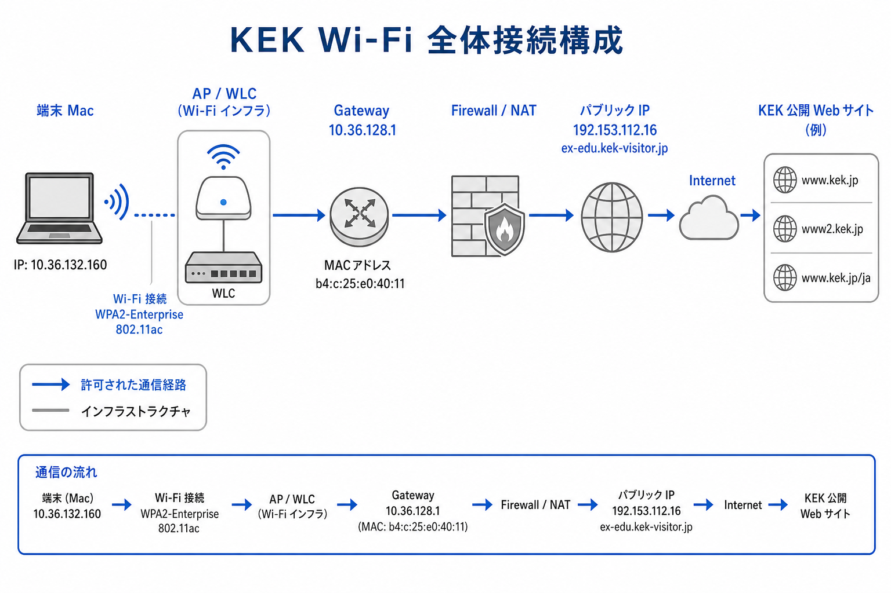
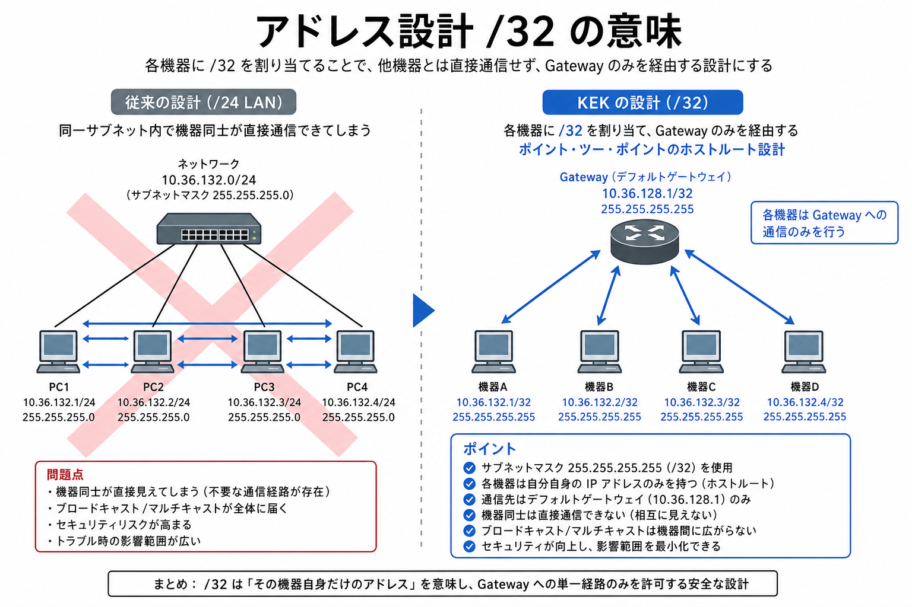
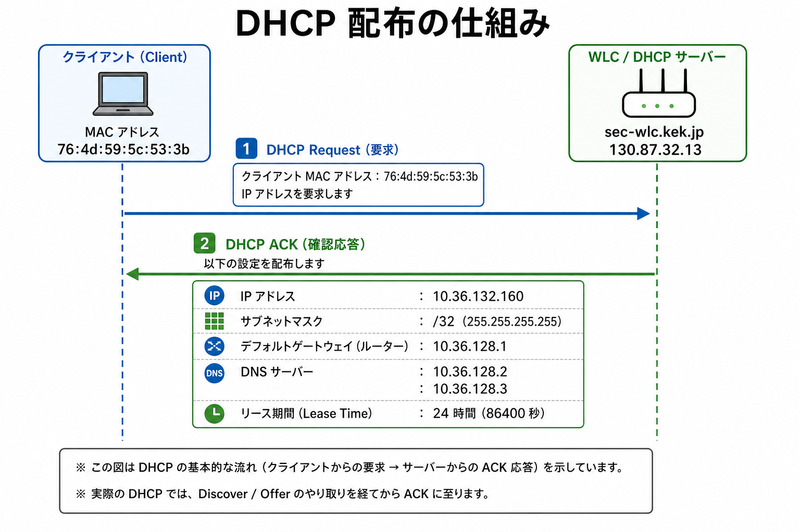
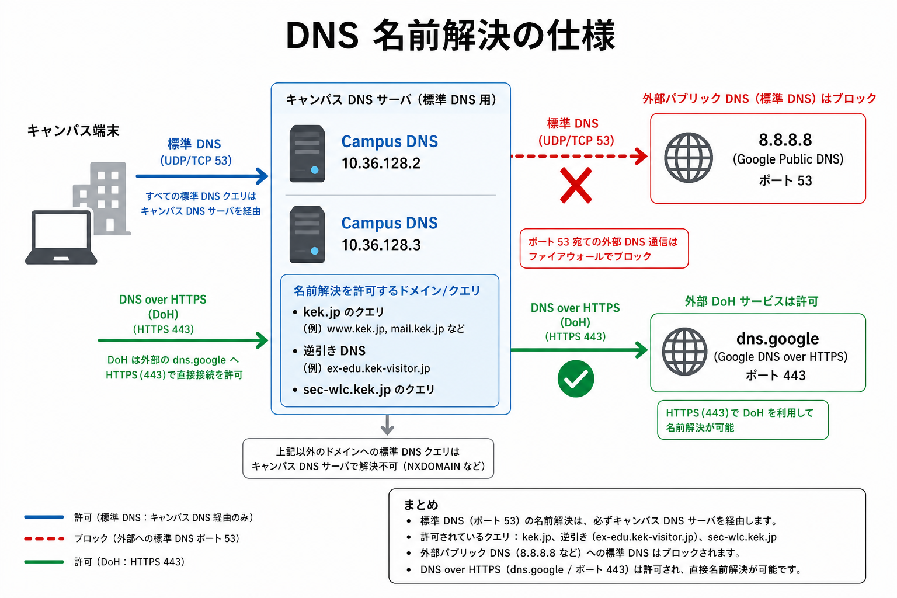
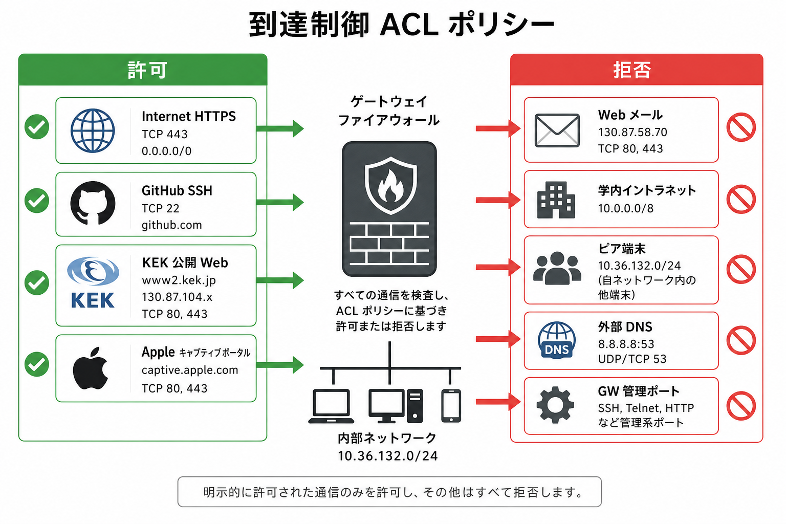
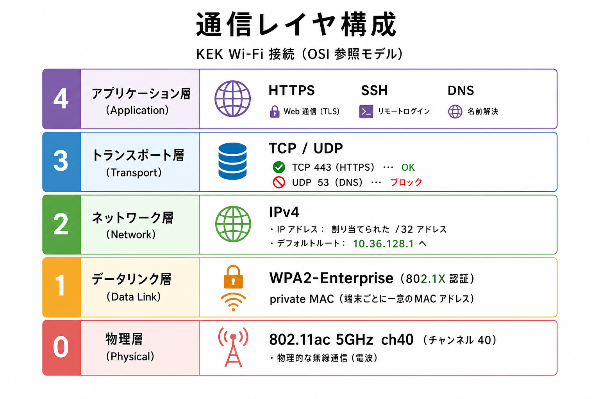
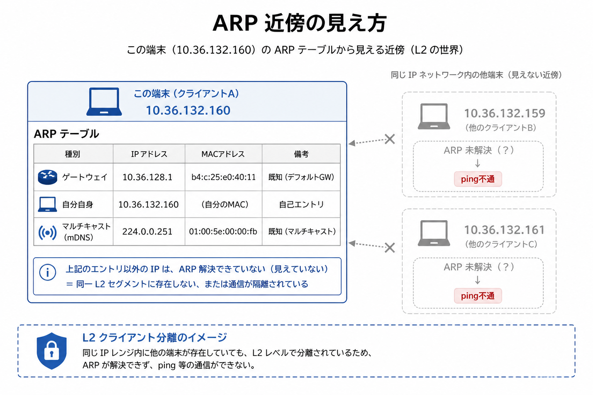
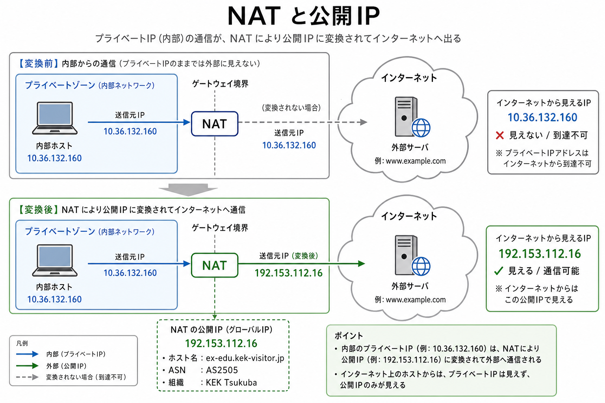
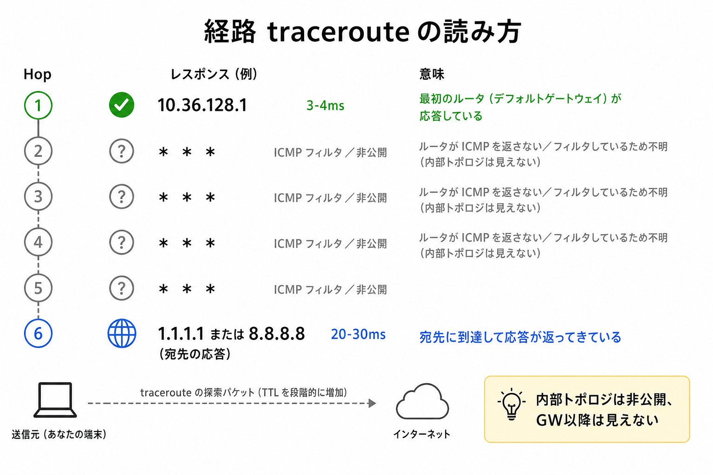
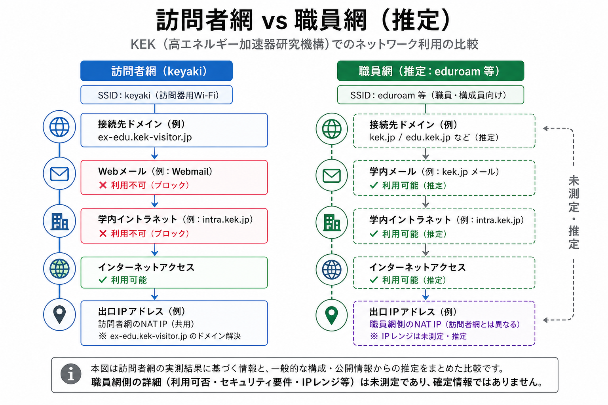

# KEK キャンパスWi-Fi ネットワーク仕様（内部観測）

調査日: 2026-08-21 〜 2026-08-22  
調査方法: 接続中の Mac から `ifconfig`, `ipconfig`, `scutil`, `dig`, `curl`, `ping`, `traceroute`, `nc` 等で観測  
図: `figures/` 配下 10 枚

> **注意:** 本資料は端末内部から観測できる事実と、その推論のみを記載する。コントローラ・ファイアウォールの機種名、VLAN ID、ACL全文などサーバ側にしかない情報は含まない。

---

## 接続スナップショット（2026-08-22 時点）

| 項目 | 値 |
|------|-----|
| インタフェース | Wi-Fi `en0` |
| プライベートIP | `10.36.132.160` |
| サブネットマスク | `255.255.255.255`（/32） |
| デフォルトGW | `10.36.128.1`（MAC `b4:c:25:e0:40:11`） |
| DNS | `10.36.128.2`, `10.36.128.3` |
| DHCPサーバ | `130.87.32.13`（`sec-wlc.kek.jp`） |
| リース | 24時間 |
| 公開IP | `192.153.112.16`（`ex-edu.kek-visitor.jp`） |
| 認証 | WPA2 Enterprise |
| 無線 | 802.11ac / 5GHz ch40 / RSSI −46 dBm |
| プロキシ | なし |
| グローバルIPv6 | なし |

---

## 図1. 全体接続構成



| 根拠 | わかること |
|------|------------|
| `ifconfig en0` | プライベートIP `10.36.132.160` |
| `route -n get default` | 全通信は GW `10.36.128.1` 経由 |
| `curl ifconfig.me` | 外向きは `192.153.112.16`（NAT） |
| 逆引き | 出口名 `ex-edu.kek-visitor.jp`（訪問者系） |

---

## 図2. /32マスクと端末隔離



| 根拠 | わかること |
|------|------------|
| DHCP `subnet_mask: 255.255.255.255` | /32 設計 |
| `netstat -rn` | ホスト単位の経路 |
| 近傍 `10.36.132.x` へ ping 不通 | 端末間直接通信不可 |
| ARP に GW 以外ほぼなし | L2 クライアント隔離 |

---

## 図3. DHCP配布フロー



| 根拠 | わかること |
|------|------------|
| `ipconfig getpacket en0` | DHCP ACK で全設定取得 |
| `server_identifier: 130.87.32.13` | WLC（`sec-wlc.kek.jp`）が集中配布 |
| `lease_time: 0x15180` | リース 24時間 |
| オプション最小限 | IP/GW/DNS/lease のみ |

---

## 図4. DNS構成



| 根拠 | わかること |
|------|------------|
| `scutil --dns` | キャンパスDNS `10.36.128.2/3` 必須 |
| `dig @10.36.128.2 kek.jp SOA` | KEK公式ゾーン解決可 |
| `nc 8.8.8.8 53` 不通 | 外部DNS直打ち遮断 |
| DoH `dns.google` 成功 | HTTPS上のDNSは迂回可能 |

---

## 図5. ACL（許可／拒否）



| 根拠 | わかること |
|------|------------|
| `curl https://www2.kek.jp` → 200 | KEK公開Web 許可 |
| `curl https://webmail.kek.jp` → タイムアウト | 学内メール 拒否 |
| `nc github.com 22` → OK | 外向きSSH 許可 |
| GW TCP 80/443/22 → 閉 | 管理面は端末から不可 |

---

## 図6. レイヤ構成



| 根拠 | わかること |
|------|------------|
| `system_profiler SPAirPortDataType` | 802.11ac / WPA2 Enterprise |
| MTU 1500 | 標準Ethernet |
| `scutil --nwi` IPv6 なし | グローバルIPv6未使用 |
| プロキシ設定なし | 明示プロキシ強制なし |

---

## 図7. ARPと近傍隔離



| 根拠 | わかること |
|------|------------|
| `arp -an` | GW MAC のみ実機、他端末なし |
| 自IP `permanent` | 自分自身のみ確定 |
| mDNS マルチキャストのみ追加 | 一部マルチキャスト可 |
| 他 `10.36.132.x` ping 不通 | ピアツーピア不可 |

---

## 図8. NATと公開IP



| 根拠 | わかること |
|------|------------|
| 内部 `10.36.132.160` / 外部 `192.153.112.16` | NAT変換 |
| 逆引き `ex-edu.kek-visitor.jp` | 訪問者出口プール |
| ipinfo → AS2505 KEK | KEK自律システム経由 |
| `192.153.112.0/24` | 訪問者用公開帯 |

---

## 図9. 経路と可視性



| 根拠 | わかること |
|------|------------|
| traceroute 1hop `10.36.128.1` ~4ms | GWまでは確認可 |
| 2hop以降 `*` | 中間機器は非公開 |
| webmail traceroute も同様 | 内部トポロジは端末から不可 |

---

## 図10. 訪問者網 vs 職員網（推定）



| 根拠 | わかること |
|------|------------|
| 出口名 `kek-visitor` | 今回は訪問者網 |
| webmail不通 / 公開Web可 | 職員イントラとは別ACL |
| 優先ネットワークに `eduroam` | 職員系は別SSIDの可能性 |
| 職員側は未測定 | 右側は推定（破線） |

---

## 到達性テスト結果（再確認 2026-08-22）

| テスト | 結果 |
|--------|------|
| ping `10.36.128.1` | OK |
| TCP `10.36.128.2:53` | OK |
| TCP `8.8.8.8:53` | NG |
| TCP `130.87.58.70:443` (webmail) | NG |
| TCP `github.com:22` | OK |
| HTTPS `www2.kek.jp` | 200 |
| HTTPS `webmail.kek.jp` | タイムアウト |
| captive.apple.com | Success（ポータルなし） |
| DoH dns.google | OK |
| peer `10.36.132.159/161` ping | NG |

---

## 内部から確定できる仕様まとめ

1. WPA2-Enterprise キャンパスWi-Fi
2. /32 + クライアント隔離
3. WLC 集中 DHCP（24hリース）
4. キャンパスDNS強制（53番遮断、DoHは可）
5. 訪問者NAT出口 `ex-edu.kek-visitor.jp`
6. Internet + 公開Web可、イントラ不可
7. 外向きSSH可
8. キャプティブポータルなし
9. グローバルIPv6なし
10. 職員網との差は推定（未測定）

---

## 参考（公開情報・前回調査）

- KEK AS2505 / HEPNET-J
- 計算科学センター: KEK-LAN, JLAN, KEKCC
- SINET6: つくば 130Gbps, J-PARC 30Gbps, 拠点間 20Gbps
- HEPnet-J: 2023-09-29 廃止

---

## ファイル構成

```
ネットワーク調査_20260822/
├── ネットワーク仕様_内部観測.md   ← 本ファイル
├── kek_jp_サブドメイン.md         ← 公開DNS調査（kek.jp）
└── figures/
    ├── 01_全体接続構成.png
    ├── …（内部観測 01–10）
    └── kek_jp/
        ├── 01_kek_dns_basic.png
        ├── …（サブドメイン 01–10）
        └── 10_kek_overview_map.png
```
