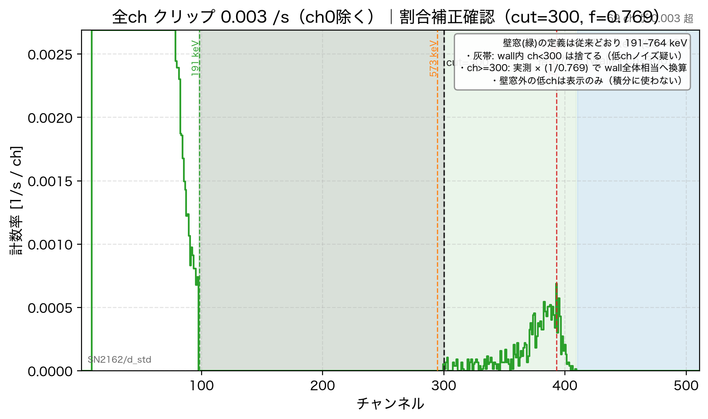

# 地点別_denoised（割合補正の確認用スペクトル）

本解析の `figures/地点別/` とは別。**確認用**です。

## 図の読み方（例: PS）



| 要素 | 意味 |
|------|------|
| **緑の帯** | wall窓（191–764 keV）。**定義は従来どおり** |
| **灰の帯** | wall内で **ch<300**。低chノイズ疑いのため **積分から捨てた** |
| **黒破線 cut=300** | これより右だけを使う境界 |
| **cutより右の山** | 実測カウントを **×(1/0.769)** した形。 wall全体相当の NET になるよう振幅を上げている |
| **青の帯** | 764 keV より右の側帯（方式B後はほぼ0） |
| **壁窓より左の高い山** | 壁窓の外。**フラックス計算には使わない**（表示のみ） |

## 補正の式

`R_corr = N(ch>=300 ∩ wall) / 0.769`

- `0.769` は熱中性子 d1（30cm・80cm）の形状比（指定値）
- 対象は強ノイズ small_d **4件のみ**

## 対象フォルダ

- `d1_20260823_1509_linac_testhole/`
- `d2_20260821_080725_linac/`
- `d1_20260823_1509_PS/`
- `d2_20260822_155046_地上/`

## fig16–19

`theory_16_19/` … 補正後のフラックス点を載せた確認用図

## 本解析への反映

確認OKなら次を実行（または「本解析にマージして」と指示）:

```bash
python3 03_今年度用/build_denoised_review.py --merge
```
