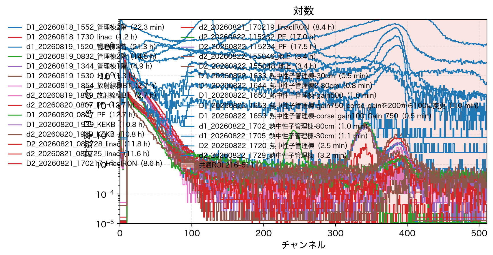
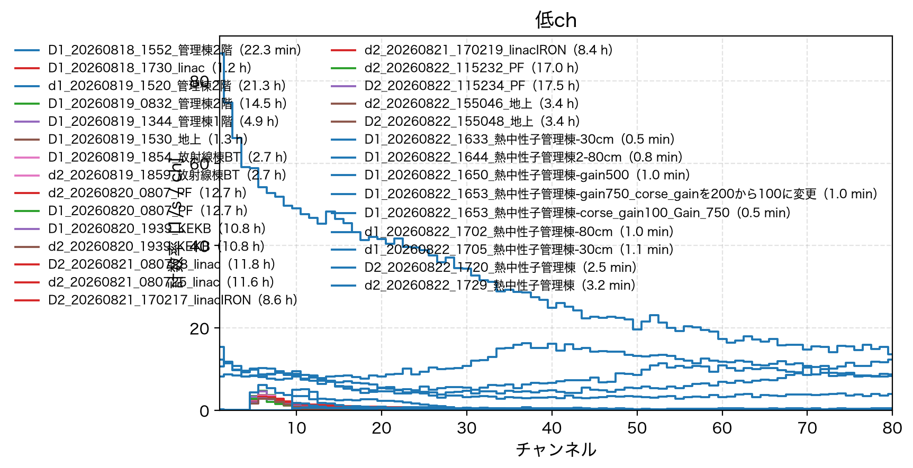
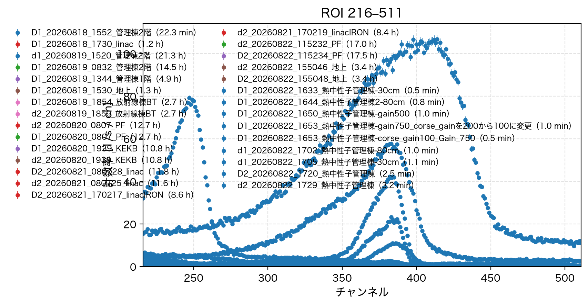
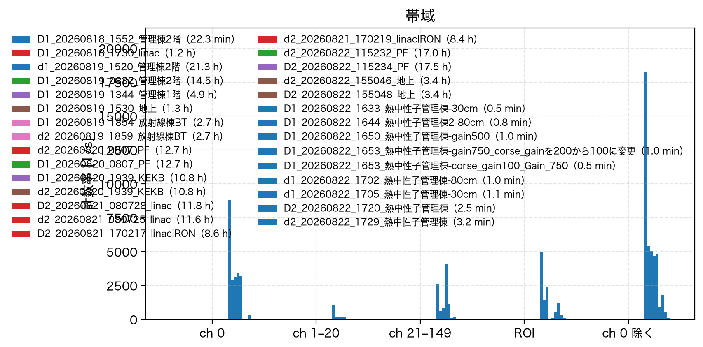

# 今年度 MCA 測定の解析報告（2026-08-18〜19）

**測定日**: 2026-08-18 15:30 〜 2026-08-19 08:32（終夜を含む）  
**場所**: KEK つくばキャンパス（標高仮定 30 m、いずれも屋内）  
**装置**: Amptek MCA8000D（シリアル 1715、ファームウェア 6.09、512 ch、GAIA=2）  
**解析日**: 2026-08-19  
**生データ**: `raw/*.mca`　表: `tables/`　図: `figures/`  
**ファイル名**: 終了時刻規則。過去名との対応は [`ファイル名規則.md`](ファイル名規則.md) と [`tables/ファイル名対応.csv`](tables/ファイル名対応.csv)

---

## 1. 要旨

同一 MCA で、管理棟2階の短時間・終夜と linac 建屋の3スペクトルを取得した。較正は未実施のため、縦軸は live time で割らない生カウント、または live time で割った計数率 \(R=N/t_\mathrm{live}\) で議論する。昨年9班の熱中性子／MeV 窓の計数率とは窓定義が違うので直接比較しない。

主な結果は次のとおりである。

1. **raw/ の `.mca` を再処理した。** SN 1715 が D 系列、SN 2162 が d 系列。2162 は ch 0 が空でピーク位置も違うため、1715 と窓を混ぜない。差の主因は **小文字 d 検出器の応答**であり、放射線棟2階という場所名は誤記（当該棟に2階はない）。
2. **SN 1715 のスペクトル骨格は共通**（ch 0 ≈ 49%、低ch頂点 ch 6、高ch山 ≈ ch 340）。
3. **管理棟2階の短時間と終夜は一致**する。終夜を屋内基準にする。
4. **管理棟1階の ROI CPS は2階終夜の 0.72**（低chは 0.97）。階で高ch成分が変わる。
5. **地上（屋外）は全体 CPS が屋内の約 0.64**。ROI は 0.80 で、高chピークは屋内の方が強い（コンクリート中の環境ガンマと整合）。
6. **linac の高chピークは管理棟2階の約 1/8。**
7. 空気中の λ は標高差が無いため今年度だけでは出せない（昨年の熱中性子 **1475 ± 29 m**）。

---

## 2. 測定ログ

`python3 03_今年度用/_build_mca_xlsx.py --no-usb` で `raw/*.mca` 6本を自動検出して再処理した（2026-08-19）。

| 項目 | 管理棟2F | linac | 管理棟2階 d1 | 管理棟2階終夜 D1 | 管理棟1階 | 地上 |
|------|----------|-------|--------------|-----------------|----------|------|
| ファイル | `D1_20260818_1552_管理棟2階.mca` | `D1_20260818_1730_linac.mca` | `d1_20260819_1520_管理棟2階.mca` | `D1_20260819_0832_管理棟2階.mca` | `D1_20260819_1344_管理棟1階.mca` | `D1_20260819_1530_地上.mca` |
| 旧名（装置メモ） | `20260818_1552_管理棟2F` | `20260818_1730_linac` | `0819放射線棟2階d1` | `管理棟2階_0819` | `管理棟1階_0819` | `D1＿地上_0819` |
| シリアル | 1715 | 1715 | **2162** | 1715 | 1715 | 1715 |
| 屋内/外 | 屋内 | 屋内 | 屋内 | 屋内 | 屋内 | **屋外** |
| 開始 | 08/18 15:30:09 | 08/18 16:19:46 | 08/18 17:59:38 | 08/18 18:00:44 | 08/19 08:52:40 | 08/19 14:11:03 |
| Live | 1335.4 s（22.3 min） | 4208.9 s（1.17 h） | 76826 s（21.34 h） | 52247 s（14.51 h） | 17482 s（4.86 h） | 4748 s（1.32 h） |
| Dead | 0.100% | 0.114% | 0.010% | 0.102% | 0.100% | 0.063% |
| \(N\) | 87 283 | 302 171 | 289 798 | 3 490 462 | 1 131 721 | 203 879 |
| 全体 CPS | 65.36 | 71.79 | **3.77** | 66.81 | 64.74 | **42.94** |
| ch0除く CPS | 33.15 | 36.85 | 3.77 | 33.89 | 32.95 | 21.84 |
| ch0 割合 | 49.3% | 48.7% | **0%** | 49.3% | 49.1% | 49.1% |
| 自動 ROI | 314–366 | 311–362 | **350–408** | 314–366 | 313–366 | 313–365 |
| ROI CPS | 0.5684 | 0.0779 | 0.1397 | 0.5999 | 0.4335 | 0.4812 |
| 純ピーク CPS | 0.4625 | 0.0563 | 0.1202 | 0.4773 | 0.3408 | 0.3873 |
| ピーク ch | 343 | 341 | **389** | 342 | 339 | 340 |
| 低ch頂点 | 6 | 6 | **11** | 6 | 6 | 6 |
| 温度 | 43 °C | 39 °C | 42 °C | 42 °C | 40 °C | 45 °C |

SN 1715 の D1 は MCAC=512、GAIA=2、THSL=1.000、PDMD=MIN。管理棟2階 d1（SN 2162）は THSL=2.001、PDMD=NORM で **ch 0 に溜まらない**。Dead time はいずれも 0.12% 以下。CPS の桁違い（約 3.8 vs 約 67 s⁻¹）は場所ではなく **d 検出器の観測能力・設定**による。

ソフト上のファイル ROI（150–450 または 150–500）は使わず、スペクトルから自動抽出した窓を使う。SN 2162 の高ch山は ch ≈ 389 にあり、1715 の ch ≈ 341 と別物である。

計数率はすべて \(R = N / t_\mathrm{live}\) [s⁻¹]、誤差はポアソン \(\delta R = \sqrt{N}/t_\mathrm{live}\)（68%）。機械可読版は `tables/測定記録.csv`、`tables/計数率カタログ.csv`。

---

## 3. スペクトルの構造



対数表示では次の3成分がはっきり分かれる。

| 成分 | チャンネル | 終夜での割合 | 解釈 |
|------|------------|--------------|------|
| オーバーフロー | ch 0 | 49.3% | ADC がレンジ外。解析から除外する |
| 低ch連続＋ピーク | ch 1–20（頂点 ch 6） | 38.8% | 閾値付近。ノイズ・散乱・低エネルギー光子の混合物 |
| 中間連続 | ch 21–149 | 10.7% | 低chピークの裾 |
| 高chピーク | 自動 ROI（終夜 314–366） | 0.90% | 幅の狭い山。本解析の主対象 |
| その他 | 上記以外 | ≲ 0.3% | 高ch連続。ほぼ平坦 |

ch 0 を除いた計数率は管理棟で 33.1–33.9 s⁻¹、linac で 36.9 s⁻¹ である。全体計数率の差の大半は **低ch側** にあり、高chピークの寄与は 1 s⁻¹ 未満である。



ch 6 の計数率は管理棟短時間 4.811 ± 0.060 s⁻¹、終夜 4.809 ± 0.010 s⁻¹ で一致する。linac は 4.655 ± 0.033 s⁻¹ で約 3% 低い。ch 1–20 の積分では linac の方が約 7% 高い（第6節）。低chは「同じ形のピーク＋わずかに厚い裾」になっている。

---

## 4. 自動 ROI と NET CPS

比較は生カウントではなく **NET / live time [s]** の CPS で行う。

\[
\mathrm{CPS_{NET}} = N_{\mathrm{net}} / t_{\mathrm{live}},\qquad
N_{\mathrm{net}} = N_{\mathrm{ROI}} - N_{\mathrm{bg}}
\]

背景 \(N_{\mathrm{bg}}\) は ROI 端点6 ch の直線。誤差は \(\sqrt{N_{\mathrm{ROI}}+N_{\mathrm{bg}}}/t_{\mathrm{live}}\)。実行時間は MCA の **LIVE_TIME** [s]（不感時間を除く）。

| 地点 | SN | \(t_{\mathrm{live}}\) [s] | \(N_{\mathrm{ROI}}\) | \(N_{\mathrm{net}}\) | **CPS_NET [s⁻¹]** |
|------|-----|--------------------------:|---------------------:|---------------------:|------------------:|
| 管理棟2F | 1715 | 1335.366 | 759 | 617.7 | **0.46255 ± 0.02247** |
| linac | 1715 | 4208.884 | 328 | 237.0 | **0.05631 ± 0.00486** |
| 管理棟2階終夜 | 1715 | 52246.972 | 31342 | 24937.8 | **0.47731 ± 0.00372** |
| 管理棟1階 | 1715 | 17482.328 | 7578 | 5958.0 | **0.34080 ± 0.00549** |
| 地上（屋外） | 1715 | 4748.053 | 2285 | 1839.0 | **0.38730 ± 0.01101** |
| 管理棟2階 d1 | 2162 | 76826.197 | 10734 | 9234.4 | **0.12020 ± 0.00144** |

表: `tables/ROI_NET_CPS.csv`。重ね書きの図も CPS（s⁻¹ / ch）に直した。SN 2162 は別検出器なので NET CPS を 1715 と並べてもスペクトルは比較できない。

アルゴリズムは、ch ≥ 80 を5チャンネル平滑し、argmax をピークとする。ピーク ±40 ch 以外の中央値を背景、閾値を \(\mathrm{bg}+0.15(h-\mathrm{bg})\) として左右に歩き、±8 ch のパッドを付ける。

### 4.1 窓の定義と CPS

ファイルに書かれた `<<ROI>>`（150–450）はピークを含むが、連続成分も多く混ぜる。解析の主窓は自動 ROI。地点比較には共通窓 314–366（終夜の自動 ROI）を使う。重ね書きの表示は和集合 311–366。

| 項目 | 管理棟2F | linac | 終夜 |
|------|----------|-------|------|
| 自動 ROI [ch] | 314–366 | 311–362 | 314–366 |
| 窓幅 | 53 ch | 52 ch | 53 ch |
| ピーク ch（生データの argmax） | 343 | 341 | 342 |
| ピーク \(N\) | 28 | 14 | 1 320 |
| ピーク CPS [s⁻¹] | 0.02097 ± 0.00396 | 0.00333 ± 0.00089 | 0.02527 ± 0.00070 |
| 自動 ROI \(N\) | 759 | 328 | 31 342 |
| 自動 ROI CPS [s⁻¹] | **0.56838 ± 0.02063** | **0.07793 ± 0.00430** | **0.59988 ± 0.00339** |
| 相対誤差 \(1/\sqrt{N}\) | 3.63% | 5.52% | 0.565% |
| ROI / 全体 CPS | 0.870% | 0.109% | 0.898% |
| ROI / ch0除く CPS | 1.715% | 0.212% | 1.770% |

| 窓 | 管理棟2F CPS | linac CPS | 終夜 CPS |
|----|--------------|-----------|----------|
| ファイル ROI 150–450 | 0.74362 ± 0.02360（N=993） | 0.10050 ± 0.00489（N=423） | 0.77327 ± 0.00385（N=40 401） |
| 自動 ROI（各地点） | 0.56838 ± 0.02063（N=759） | 0.07793 ± 0.00430（N=328） | 0.59988 ± 0.00339（N=31 342） |
| 共通 314–366 | 0.56838 ± 0.02063（N=759） | 0.07793 ± 0.00430（N=328） | 0.59988 ± 0.00339（N=31 342） |
| 和集合 311–366 | 0.57213 ± 0.02070（N=764） | 0.07888 ± 0.00433（N=332） | 0.60300 ± 0.00340（N=31 505） |

linac の自動 ROI は 311–362 だが、314–366 にしても \(N=328\) で同じである（ch 311–313 と 363–366 の寄与が打ち消し合う程度に小さい）。ファイル ROI 150–450 は自動 ROI より CPS が約 30% 大きい（終夜 0.773 / 0.600）。差はピーク外の連続（ch 150–313 と 367–450）である。

### 4.2 背景差し引き後の純ピーク CPS

端点6チャンネルで直線背景を引き、残差の1次・2次モーメントからガウス幅を求めた（簡易フィット。最尤法ではない）。純カウントの誤差は \(\sqrt{N_\mathrm{tot}+N_\mathrm{bg}}\)。

| | 管理棟2F | linac | 終夜 |
|--|----------|-------|------|
| 中心 \(\mu\) [ch] | 341.06 | 338.26 | 340.78 |
| \(\sigma\) [ch] | 8.03 | 8.04 | 7.80 |
| FWHM [ch] | 18.91 | 18.92 | 18.36 |
| 窓内 \(N_\mathrm{tot}\) | 759 | 328 | 31 342 |
| 背景 \(N_\mathrm{bg}\) | 141.3 | 91.0 | 6 404.2 |
| 純ピーク \(N_\mathrm{net}\) | 617.7 ± 30.0 | 237.0 ± 20.5 | 24 937.8 ± 194.3 |
| 窓内 CPS [s⁻¹] | 0.56838 ± 0.02063 | 0.07793 ± 0.00430 | 0.59988 ± 0.00339 |
| 背景 CPS [s⁻¹] | 0.10584 | 0.02162 | 0.12258 |
| **純ピーク CPS** [s⁻¹] | **0.46255 ± 0.02247** | **0.05631 ± 0.00486** | **0.47731 ± 0.00372** |
| SNR（\(N_\mathrm{net}/\delta N_\mathrm{net}\)） | 20.59 | 11.58 | 128.36 |

終夜ではピーク1チャンネル（ch 342、1320 カウント、0.02527 ± 0.00070 s⁻¹）だけでも、隣接帯（ch 280–310 と 370–400）の中央値 46 に対して excess ≈ 1274、有意度 ≈ 34σ である。**この山は統計ゆらぎではない。**



### 4.3 ROI チャンネル別（ch 311–366）

\(N\) と CPS。終夜のピークは ch 340–344 で頭が平坦（1355, 1359, 1320, 1360, 1334）。短時間は統計が粗く、見かけの頂点が ch 345（37 カウント、0.0277 s⁻¹）にずれる。linac の頂点は ch 342（21 カウント、0.00499 s⁻¹）。

| ch | 管理棟2F \(N\) | 管理棟2F CPS | linac \(N\) | linac CPS | 終夜 \(N\) | 終夜 CPS |
|----|----------------:|-------------:|------------:|----------:|-----------:|---------:|
| 311 | 2 | 0.00150 | 2 | 0.00048 | 55 | 0.00105 |
| 312 | 1 | 0.00075 | 1 | 0.00024 | 54 | 0.00103 |
| 313 | 2 | 0.00150 | 1 | 0.00024 | 54 | 0.00103 |
| 314 | 2 | 0.00150 | 0 | 0 | 56 | 0.00107 |
| 315 | 1 | 0.00075 | 3 | 0.00071 | 87 | 0.00167 |
| 316 | 0 | 0 | 2 | 0.00048 | 110 | 0.00211 |
| 317 | 4 | 0.00300 | 0 | 0 | 80 | 0.00153 |
| 318 | 3 | 0.00225 | 0 | 0 | 108 | 0.00207 |
| 319 | 2 | 0.00150 | 0 | 0 | 130 | 0.00249 |
| 320 | 3 | 0.00225 | 3 | 0.00071 | 145 | 0.00278 |
| 321 | 4 | 0.00300 | 4 | 0.00095 | 157 | 0.00300 |
| 322 | 6 | 0.00449 | 6 | 0.00143 | 182 | 0.00348 |
| 323 | 4 | 0.00300 | 3 | 0.00071 | 252 | 0.00482 |
| 324 | 9 | 0.00674 | 2 | 0.00048 | 288 | 0.00551 |
| 325 | 6 | 0.00449 | 4 | 0.00095 | 328 | 0.00628 |
| 326 | 9 | 0.00674 | 7 | 0.00166 | 339 | 0.00649 |
| 327 | 11 | 0.00824 | 10 | 0.00238 | 403 | 0.00771 |
| 328 | 10 | 0.00749 | 8 | 0.00190 | 489 | 0.00936 |
| 329 | 9 | 0.00674 | 8 | 0.00190 | 584 | 0.01118 |
| 330 | 14 | 0.01048 | 3 | 0.00071 | 634 | 0.01214 |
| 331 | 16 | 0.01198 | 9 | 0.00214 | 728 | 0.01393 |
| 332 | 17 | 0.01273 | 8 | 0.00190 | 793 | 0.01518 |
| 333 | 20 | 0.01498 | 10 | 0.00238 | 826 | 0.01581 |
| 334 | 24 | 0.01797 | 7 | 0.00166 | 892 | 0.01707 |
| 335 | 21 | 0.01573 | 15 | 0.00356 | 964 | 0.01845 |
| 336 | 33 | 0.02471 | 10 | 0.00238 | 1 072 | 0.02052 |
| 337 | 30 | 0.02247 | 14 | 0.00333 | 1 120 | 0.02144 |
| 338 | 22 | 0.01647 | 16 | 0.00380 | 1 161 | 0.02222 |
| 339 | 29 | 0.02172 | 13 | 0.00309 | 1 257 | 0.02406 |
| **340** | 31 | 0.02321 | 16 | 0.00380 | **1 355** | **0.02594** |
| **341** | **35** | **0.02621** | 14 | 0.00333 | **1 359** | **0.02601** |
| **342** | **35** | **0.02621** | **21** | **0.00499** | 1 320 | 0.02527 |
| **343** | 28 | 0.02097 | 16 | 0.00380 | **1 360** | **0.02603** |
| 344 | 31 | 0.02321 | 9 | 0.00214 | 1 334 | 0.02553 |
| 345 | 37 | 0.02771 | 9 | 0.00214 | 1 265 | 0.02421 |
| 346 | 32 | 0.02396 | 10 | 0.00238 | 1 159 | 0.02218 |
| 347 | 27 | 0.02022 | 11 | 0.00261 | 1 078 | 0.02063 |
| 348 | 32 | 0.02396 | 10 | 0.00238 | 1 133 | 0.02169 |
| 349 | 32 | 0.02396 | 8 | 0.00190 | 1 072 | 0.02052 |
| 350 | 24 | 0.01797 | 2 | 0.00048 | 1 001 | 0.01916 |
| 351 | 16 | 0.01198 | 9 | 0.00214 | 776 | 0.01485 |
| 352 | 14 | 0.01048 | 0 | 0 | 616 | 0.01179 |
| 353 | 9 | 0.00674 | 3 | 0.00071 | 579 | 0.01108 |
| 354 | 8 | 0.00599 | 2 | 0.00048 | 456 | 0.00873 |
| 355 | 12 | 0.00899 | 3 | 0.00071 | 364 | 0.00697 |
| 356 | 7 | 0.00524 | 4 | 0.00095 | 273 | 0.00523 |
| 357 | 8 | 0.00599 | 3 | 0.00071 | 239 | 0.00457 |
| 358 | 3 | 0.00225 | 2 | 0.00048 | 192 | 0.00367 |
| 359 | 5 | 0.00374 | 3 | 0.00071 | 196 | 0.00375 |
| 360 | 4 | 0.00300 | 1 | 0.00024 | 151 | 0.00289 |
| 361 | 4 | 0.00300 | 1 | 0.00024 | 167 | 0.00320 |
| 362 | 5 | 0.00374 | 2 | 0.00048 | 160 | 0.00306 |
| 363 | 1 | 0.00075 | 1 | 0.00024 | 143 | 0.00274 |
| 364 | 5 | 0.00374 | 1 | 0.00024 | 136 | 0.00260 |
| 365 | 4 | 0.00300 | 2 | 0.00048 | 152 | 0.00291 |
| 366 | 1 | 0.00075 | 0 | 0 | 121 | 0.00232 |

チャンネルごとの誤差は `tables/ROI_チャンネル.csv` の `cps_err_*` 列（終夜ピーク付近で約 0.00070 s⁻¹、短時間で約 0.004 s⁻¹、linac で約 0.001 s⁻¹）。

10 ch 幅の積分 CPS [s⁻¹]（ビン合計）:

| ch | 管理棟2F | linac | 終夜 |
|----|----------|-------|------|
| 300–309 | 0.0090 | 0.0017 | 0.0091 |
| 310–319 | 0.0142 | 0.0021 | 0.0151 |
| 320–329 | 0.0532 | 0.0131 | 0.0606 |
| 330–339 | 0.1692 | 0.0249 | 0.1808 |
| 340–349 | 0.2396 | 0.0295 | 0.2380 |
| 350–359 | 0.0794 | 0.0074 | 0.0898 |
| 360–369 | 0.0240 | 0.0029 | 0.0260 |
| 370–379 | 0.0112 | 0.0017 | 0.0151 |

---

## 5. 帯域ごとの CPS カタログ

\(R \pm \delta R\) [s⁻¹]。括弧内は \(N\)。

| 帯域 | 管理棟2F | linac | 終夜 | linac / 終夜 |
|------|----------|-------|------|--------------|
| 全 ch | 65.363 ± 0.221（87 283） | 71.794 ± 0.131（302 171） | 66.807 ± 0.036（3 490 462） | 1.075 |
| ch 0 | 32.216 ± 0.155（43 020） | 34.943 ± 0.091（147 072） | 32.915 ± 0.025（1 719 691） | 1.062 |
| ch 0 除く | 33.147 ± 0.158（44 263） | 36.850 ± 0.094（155 099） | 33.892 ± 0.025（1 770 771） | 1.087 |
| ch 1–20 | 25.523 ± 0.138（34 082） | 27.825 ± 0.081（117 111） | 25.936 ± 0.022（1 355 084） | 1.073 |
| ch 21–80 | 6.759 ± 0.071（9 026） | 8.884 ± 0.046（37 391） | 7.067 ± 0.012（369 242） | 1.257 |
| ch 21–149 | 6.856 ± 0.072（9 155） | 8.923 ± 0.046（37 557） | 7.161 ± 0.012（374 121） | 1.246 |
| ch 81–149 | 0.0966 ± 0.0085（129） | 0.0394 ± 0.0031（166） | 0.0934 ± 0.0013（4 879） | 0.422 |
| ch 150–313 | 0.1146 ± 0.0093（153） | 0.0150 ± 0.0019（63） | 0.1183 ± 0.0015（6 181） | 0.127 |
| ファイル ROI 150–450 | 0.7436 ± 0.0236（993） | 0.1005 ± 0.0049（423） | 0.7733 ± 0.0038（40 401） | 0.130 |
| **自動 ROI** | **0.5684 ± 0.0206（759）** | **0.07793 ± 0.00430（328）** | **0.5999 ± 0.0034（31 342）** | **0.130** |
| 左背景 280–310 | 0.0255 ± 0.0044（34） | 0.00499 ± 0.00109（21） | 0.0288 ± 0.00074（1 505） | 0.173 |
| 右背景 370–400 | 0.0270 ± 0.0045（36） | 0.00404 ± 0.00098（17） | 0.0280 ± 0.00073（1 461） | 0.144 |
| ch 200–300 | 0.0726 ± 0.0074（97） | 0.0105 ± 0.0016（44） | 0.0691 ± 0.0012（3 609） | 0.151 |
| ch 400–500 | 0.0494 ± 0.0061（66） | 0.00475 ± 0.00106（20） | 0.0409 ± 0.00089（2 137） | 0.116 |
| ch 451–511 | 0.0247 ± 0.0043（33） | 0.00190 ± 0.00067（8） | 0.0223 ± 0.00065（1 165） | 0.085 |



全カウントで見ると linac は管理棟より約 9% **多い**（71.79 vs 66.81）。しかしそれは低〜中chの増加であり、ROI は約 87% **少ない**（0.0779 vs 0.5999）。地点差はスペクトルの形に出る。全チャンネル積分だけを地点比較に使うと、遮蔽の効果を打ち消してしまう。

### 5.1 低ch（ch 0–20）のチャンネル別 CPS

頂点は3測定とも **ch 6**。ch 1–4 はほぼ空（閾値以下）。

| ch | 管理棟2F CPS | linac CPS | 終夜 CPS |
|----|----------------|-----------|----------|
| 0 | 32.216 ± 0.155 | 34.943 ± 0.091 | 32.915 ± 0.025 |
| 1 | 0.0022 ± 0.0013 | 0.0036 ± 0.0009 | 0.0029 ± 0.0002 |
| 2 | 0.0015 ± 0.0011 | 0.0026 ± 0.0008 | 0.0015 ± 0.0002 |
| 3 | 0.0015 ± 0.0011 | 0.0014 ± 0.0006 | 0.0014 ± 0.0002 |
| 4 | 0.0022 ± 0.0013 | 0.0007 ± 0.0004 | 0.0007 ± 0.0001 |
| 5 | 3.440 ± 0.051 | 3.488 ± 0.029 | 3.448 ± 0.008 |
| **6** | **4.811 ± 0.060** | **4.655 ± 0.033** | **4.809 ± 0.010** |
| 7 | 3.656 ± 0.052 | 3.659 ± 0.029 | 3.742 ± 0.008 |
| 8 | 2.468 ± 0.043 | 2.593 ± 0.025 | 2.545 ± 0.007 |
| 9 | 1.797 ± 0.037 | 1.964 ± 0.022 | 1.834 ± 0.006 |
| 10 | 1.429 ± 0.033 | 1.679 ± 0.020 | 1.470 ± 0.005 |
| 11 | 1.270 ± 0.031 | 1.470 ± 0.019 | 1.247 ± 0.005 |
| 12 | 1.075 ± 0.028 | 1.271 ± 0.017 | 1.092 ± 0.005 |
| 13 | 0.940 ± 0.027 | 1.161 ± 0.017 | 0.968 ± 0.004 |
| 14 | 0.852 ± 0.025 | 1.044 ± 0.016 | 0.867 ± 0.004 |
| 15 | 0.725 ± 0.023 | 0.956 ± 0.015 | 0.794 ± 0.004 |
| 16 | 0.708 ± 0.023 | 0.890 ± 0.015 | 0.718 ± 0.004 |
| 17 | 0.636 ± 0.022 | 0.844 ± 0.014 | 0.670 ± 0.004 |
| 18 | 0.591 ± 0.021 | 0.769 ± 0.014 | 0.609 ± 0.003 |
| 19 | 0.585 ± 0.021 | 0.700 ± 0.013 | 0.576 ± 0.003 |
| 20 | 0.533 ± 0.020 | 0.672 ± 0.013 | 0.542 ± 0.003 |

---

## 6. 地点比較

### 6.1 管理棟2階：短時間 vs 終夜（再現性）

同一部屋の 22 分と 14.5 時間。ch 1–80 の cps スペクトルの相関係数は **0.99984**、スケール比は 0.988 である。

| 帯域 | \(R_\text{短}/R_\text{終夜}\) |
|------|-------------------------------|
| ch 1–20 | 0.984 ± 0.005 |
| ch 21–80 | 0.956 ± 0.010 |
| ROI 314–366（gross） | 0.9475 ± 0.0348 |
| 純ピーク CPS | 0.46255 / 0.47731 = 0.969 |
| ch 0 除く | 0.978 ± 0.005 |

ROI はポアソン誤差の範囲で一致する（差は 1.5σ）。ch 1–20 は誤差よりやや低いが、差は 1.6% で、温度（43 °C vs 42 °C）や在室状況の系統の範囲である。**管理棟のスペクトルは時間を変えても安定しており、終夜を地上・屋内の基準にしてよい。**

ch 81–149 は短時間のカウントが少なく、チャンネルごとの \(\chi^2\) は大きく見える。積分比は 1.03 ± 0.09 で矛盾しない。形状議論は終夜を使う。

### 6.2 linac vs 管理棟終夜（遮蔽）

ピーク位置は 341 vs 342 で、**ゲインは同じ**と見てよい。差は強度と、低chの裾である。

| 帯域 | \(R_\text{linac}/R_\text{終夜}\) |
|------|----------------------------------|
| ch 1–20 | 1.073 ± 0.003 |
| ch 21–80 | 1.257 ± 0.007 |
| ch 81–149 | 0.422 ± 0.033 |
| ROI 314–366（gross） | **0.1299 ± 0.0072** |
| 純ピーク CPS | **0.05631 / 0.47731 = 0.118** |
| ファイル ROI 150–450 | 0.1300 ± 0.0064 |
| ch 200–300 連続 | 0.151 |
| ch 400–500 連続 | 0.116 |

高ch側（ピークも連続も）が因子 7〜8 で落ち、ch 81–149 も半分以下、ch 21–80 だけが増えている。典型的な **コンプトン散乱＋壁のビルドアップ** のパターンである。入射スペクトルの高エネルギー成分がコンクリートで散乱され、検出器に届くエネルギーが下がる。

管理棟の短時間と終夜は ROI の 10 ch ビンごとに重なる（第4.3節）。linac は同じ山の形を保ったまま、高さが約 1/8 である。

平面遮蔽の粗い見積もりとして、純ピーク比 \(0.05631/0.47731 = 0.118\) を \(\mathrm{e}^{-x/\lambda}\) と置くと光学的厚さ \(\tau=\ln(8.48)=2.14\pm0.09\)。1.5 MeV 光子のコンクリート（\(\mu/\rho \approx 0.052\,\mathrm{cm^2\,g^{-1}}\)、密度 2.3 g cm⁻³）では媒質中の平均自由行程は **λ ≈ 0.084 m（8.4 cm）**、等価厚さは **x = λτ ≈ 0.18 m（18 cm）** である。linac 建屋の壁・床として過不足ないが、立体角・ビルドアップを無視した目安に過ぎない。

### 6.3 空気中の平均自由行程 λ [m]

定義は昨年9班と同じ。空気を一様密度 \(\rho_\mathrm{air}=1.00\times10^{-3}\,\mathrm{g\,cm^{-3}}\) とし、標高差だけから求める。

\[
\lambda = \frac{\Delta h}{\ln(\phi_2/\phi_1)}\quad[\mathrm{m}],\qquad
\Lambda = \rho_\mathrm{air}\,\Delta h / \ln(\phi_2/\phi_1)\quad[\mathrm{g\,cm^{-2}}]
\]

\(\lambda\,[\mathrm{m}] = 10\,\Lambda\)。白根山は \(\Delta h = 2000\,\mathrm{m}\) と近似する（実標高 2160 m ではない）。フラックスは公開表の値。誤差はカウント \(N\) のポアソンだけを \(\phi\) に乗せて伝播した（\(\delta\lambda/\lambda = (\delta r/r)/\ln r\)）。

**今年度 MCA の3点はすべて標高 30 m なので、この式の空気中 λ は今年度データだけでは求められない。** 数値は昨年の高度差測定から出す。

| 組 | 領域 | Δh [m] | φ₂/φ₁ | **λ [m]** | Λ [g cm⁻²] |
|----|------|--------|-------|-----------|------------|
| **管理棟1階→白根山** | **熱中性子** | **2000** | **3.880** | **1475 ± 29** | **147.5** |
| 管理棟1階→白根山 | MeV | 2000 | 7.407 | 999 ± 16 | 99.9 |
| 管理棟1階→筑波山 | 熱中性子 | 877 | 1.705 | 1644 ± 115 | 164.4 |
| 管理棟1階→筑波山 | MeV | 877 | 2.607 | 915 ± 39 | 91.5 |

昨年の報告値は熱中性子 **1470 m**、MeV **1000 m**（上表を丸めたもの）。計数率 \(R\) を φ の代わりに使っても、熱 1476 m・MeV 999 m で同じである。

標準大気の大気深度 \(X(h)\) を使うと、熱中性子は λ ≈ 1640 m になる。これは昨年の定義ではない。

今年度の管理棟終夜と linac の純ピーク CPS 比 8.48 を、誤って空気の指数減衰と読むと、等価空気程は MeV の λ を使って約 **2140 m**、熱なら約 **3150 m** になる。建屋1棟分としては非現実なので、この ROI ピークを宇宙線中性子の高度依存で説明するのはできない（第7節の環境ガンマ仮説と整合する）。

機械可読: `tables/平均自由行程.csv`。

### 6.4 管理棟1階（SN 1715）

live 4.86 h。低ch（ch 1–20）は2階終夜比 **0.973 ± 0.002** でほぼ同じ。共通 ROI 314–366 は **0.721 ± 0.009**（0.432 / 0.600 s⁻¹）。純ピーク CPS は 0.341 vs 0.477。**階が下がると高ch山だけが約 28% 減る。** 昨年も地上基準に1階を使ったのは、2階の MeV が異常に大きかったためである。今年度も2階の高chが1階より高い。

### 6.5 地上・屋外（検出器 D1、SN 1715、`D1_20260819_1530_地上.mca`）

管理棟と同じ検出器 D1（SN 1715）。全体 CPS 42.94、ch0 除く 21.84 で、2階終夜の約 0.64。ROI 314–366 は **0.802 ± 0.017**（0.481 / 0.600）。ピーク位置は ch 340 のまま。屋外の方が高ch山が弱く、**屋内コンクリートの環境ガンマ仮説と向きが一致**する（宇宙線二次成分なら屋外の方が増えることが多い）。

### 6.6 管理棟2階 d1（SN 2162、`d1_20260819_1520_管理棟2階.mca`）

旧ファイル名の「放射線棟2階」は誤記（当該棟に2階はない）。約 21 h の管理棟2階測定で、検出器は d1。**ポリエチレンの緩衝材なし。** ch 0 = 0、低ch頂点 ch 11、高ch ROI 350–408・頂点 ch 389、全体 3.77 s⁻¹。閾値 THSL=2.001。**同じ部屋の D1 終夜（約 67 s⁻¹）との差は d 検出器の応答（および PE 緩衝材の有無）であり、場所の差ではない。** 1715 の ROI 314–366 とは窓もゲイン応答も違うので CPS を直接比較しない。較正も別途必要。

---

## 7. 物理的解釈と昨年データとの関係

### 7.1 高chピークの候補

エネルギー較正は無い。ただし次は整合する。

- ピークが3測定で同じチャンネルにある（安定した線、または検出器応答の決まった端）。
- FWHM / 中心 ≈ 18.4 / 340.8 ≈ 5.4%。2–3 インチ NaI(Tl) の 1.46 MeV における分解能の典型域である。
- 屋内で最も強い環境ガンマは \(^{40}\mathrm{K}\)（1460.8 keV）であることが多い。これを ch 340.8 に置くと **4.29 keV/ch**、フルスケール（ch 511）は約 2.19 MeV。\(^{208}\mathrm{Tl}\) の 2615 keV はレンジ外になる。

これは **作業仮説** である。較正線源（\(^{137}\mathrm{Cs}\) 662 keV なら約 ch 154、\(^{60}\mathrm{Co}\) 1173/1333 なら約 ch 274/311）を同じ GAIA=2 で取れば、一意に判定できる。

低chの ch 6（仮較正なら約 26 keV）は熱中性子捕獲ガンマでも宇宙線中性子でもなく、**閾値・ノイズ・散乱光子**の領域と見るのが安全である。昨年の熱中性子計数率（管理棟1階 0.163 s⁻¹）とは検出器も窓も違う。

### 7.2 昨年9班との非比較

昨年の公開表（熱中性子 ε=0.33、MeV ε=0.06）は別検出器・別エネルギー窓である。今年度の全体 66 s⁻¹ や ROI 0.60 s⁻¹ を、昨年の 0.2 s⁻¹ や 0.08 s⁻¹ と並べてはいけない。フラックス \(\phi=R/(\varepsilon S)\) は ε, S が未定のため空欄のままにする。

今年度の問いは「標高 0 m より低い領域（覆土・地下）」での宇宙線中性子である。今回の SN 1715 は標高 30 m の屋内・屋外で、**空気中の λ は今年度だけでは求められない**（第6.3節。昨年の主結果は熱中性子 **1475 ± 29 m**）。今回のデータが示すのは、

- 同じ検出器での屋内基準スペクトル（管理棟終夜）
- 建屋が違うと高ch成分が桁で変わり得ること（linac）

である。地下測定に進むときは、管理棟終夜と同じ ROI（または較正後のエネルギー窓）で \(R_\mathrm{net}\) を追うのがよい。全ch積分は ch 0 と低chに支配される。

---

## 8. 系統と限界

1. **エネルギー較正なし。** ピークの核種同定は未確定。ROI はチャンネル定義である。
2. **検出器の種類（結晶・サイズ・ハウジング）がログに無い。** 効率と立体角が書けない。
3. **ch 0 は情報を持たない。** 解析から常に除外する。ファイル ROI 150–450 も使わない。
4. **短時間の ROI は N=759 で相対誤差 3.6%。** 地点差を 10% 以下で議論するなら終夜クラスの統計が要る。linac のピーク検出自体は SNR=11.6 で足りる。
5. **linac の測定点の壁厚・階・加速器運転の有無を記録していない。** 減衰をコンクリート厚に換算するには幾何が足りない。加速器由来の中性子が増えていないことは、ROI が減っていることから「運転中の強い漏れは見えない」とは言える。
6. **気圧・気温・湿度は未記録。** 宇宙線二次成分を議論する段階では必要になる。
7. 簡易ガウスフィットは端点背景に依存する。終夜は SNR が高いので中心・幅は安定。短時間・linac の \(N_\mathrm{net}\) は背景の取り方で 10% 程度動き得る。地点比の結論（因子〜8）は変わらない。

---

## 9. 結論と次の一手

1. 管理棟2階の終夜スペクトルを、今年度 MCA の **屋内基準** とする（live 14.51 h、ROI 純ピーク 0.477 s⁻¹、中心 340.8 ch、FWHM 18.4 ch）。
2. linac では同じピークが約 **1/8** になる。ゲインはずれていない。建屋遮蔽として理解できる。
3. 全チャンネル計数率は地点差の指標に使わない。**自動 ROI（または較正後の光電ピーク）の純カウント**を使う。
4. 較正線源を同じ設定で1本取る。\(^{137}\mathrm{Cs}\) があれば足りる。
5. 地下・覆土測定では、管理棟終夜と同じ装置設定を維持し、ROI 純計数率の比から面密度を議論する。空気中の基準は昨年どおり **λ = 1470 m**（熱中性子、Λ ≈ 147 g cm⁻²）。今回の ROI ピークが光子ならコンクリート中は **λ ≈ 0.084 m** で、中性子の Λ とは別物である。

再生成:

```bash
python3 03_今年度用/_build_mca_xlsx.py
```

機械可読の全チャンネル ROI と帯域 CPS は次に置いた。

- `tables/計数率カタログ.csv` … 帯域ごとの N, CPS, 誤差
- `tables/ROI_チャンネル.csv` … ch 311–366 の N, CPS, 誤差
- `tables/平均自由行程.csv` … 昨年定義の λ [m]
